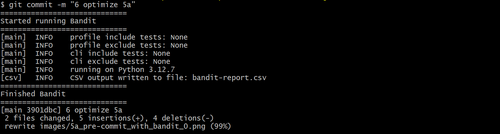

# Tasks
1. Unpack the project MLForensics.zip. (1%)
2. Put the names and emails of your teammate in this spreadsheet (1%)
3. Upload project as a GitHub repo on github.com. Format of the repo name is TEAMNAME-FALL2024-SQA (1%)
4. In your project repo create README.md listing your team name and team members. (2%)
5. Apply the following activities related to software quality assurance:
- 5.a. Create a Git Hook that will run and report all security weaknesses in the project in a CSV file whenever a Python file is changed and committed. (20%)
- 5.b. Create a fuzz.py file that will automatically fuzz 5 Python methods of your choice. Report any bugs you discovered by the fuzz.py file. fuzz.py will be automatically executed from GitHub actions. (20%)
- 5.c. Integrate forensics by modifying 5 Python methods of your choice. (20%)
- 5.d. Integrate continuous integration with GitHub Actions. (20%)
6. Report your activities and lessons learned. Put the report in your repo as REPO.md (15%)

----

# Report
### Project Objective
The objective of this project is to integrate software quality assurance activities into an existing Python project "MLForensics". Whatever we learned from our workshops will be integrated in the project.

### Task 1-4
We successfully unpacked the project and have set up a shared GitHub repository. The link to the repository is available in the shared signup sheet under the name "Defect Hunters". Additionally, a README.md file is included, which contains our team name and a list of team members.

### Task 5
#### 5.a. Git Hook
A pre-commit Git hook was implemented as a security step to automatically review Python files staged for commit, flagging potential security vulnerabilities. The hook utilizes static analysis with the Bandit tool to identify issues. The result is printed in a file named [bandit-report.csv](/bandit-report.csv).

Usually, the pre-commit hook is not part of the Git history. For this reason, we have also created an [install-hooks.sh](/install-hooks.sh) script, which copies the [pre-commit](/hooks/pre-commit) Git hook file from /hooks into .git/hooks/. Users just need to ensure that Bandit is installed.

In the following image, you can see that the Git hook works with Bandit:

Here is the generated report: [bandit-report.csv](/bandit-report.csv)
