# Tasks
1. Unpack the project MLForensics.zip. (1%)
2. Put the names and emails of your teammate in this spreadsheet (1%)
3. Upload project as a GitHub repo on github.com. Format of the repo name is TEAMNAME-FALL2024-SQA (1%)
4. In your project repo create README.md listing your team name and team members. (2%)
5. Apply the following activities related to software quality assurance:
- 5.a. Create a Git Hook that will run and report all security weaknesses in the project in a CSV file whenever a Python file is changed and committed. (20%)
- 5.b. Create a fuzz.py file that will automatically fuzz 5 Python methods of your choice. Report any bugs you discovered by the fuzz.py file. fuzz.py will be automatically executed from GitHub actions. (20%)
- 5.c. Integrate forensics by modifying 5 Python methods of your choice. (20%)
- 5.d. Integrate continuous integration with GitHub Actions. (20%)
6. Report your activities and lessons learned. Put the report in your repo as REPO.md (15%)

### Deliverables
A repo hosted on GitHub. Name of the repo will be TEAMNAME-FALL2024-SQA
Full completion of all activities as recorded on the GitHub repository
Report describing what activities your performed and what you have learned
Logs and screenshots that show execution of forensics, fuzzing, and static analysis

----

# Report
### Project Objective
The objective of this project is to integrate software quality assurance activities into an existing Python project "MLForensics". Whatever we learned from our workshops will be integrated in the project.

Our team uses different operating systems, so we utilized virtual environments (venv) to simplify the installation process across platforms ([/venv](venv)).

### Task 1-4
We successfully unpacked the project and have set up a shared GitHub repository. The link to the repository is available in the shared signup sheet under the name "Defect Hunters". Additionally, a README.md file is included, which contains our team name and a list of team members.

### Task 5
#### 5.a. Git Hook
A pre-commit Git hook was implemented as a security step to automatically review Python files staged for commit, flagging potential security vulnerabilities. The hook utilizes static analysis with the Bandit tool to identify issues. The result is printed in a file named [bandit-report.csv](5a_hooks/bandit-report.csv).

Usually, the pre-commit hook is not part of the Git history. For this reason, we have also coppied the [pre-commit](5a_hooks/pre-commit) Git hook file from '.git/hooks/' into '5a_hooks/'. Users need to ensure that Bandit is installed.

In the following image, you can see that the Git hook works with Bandit:
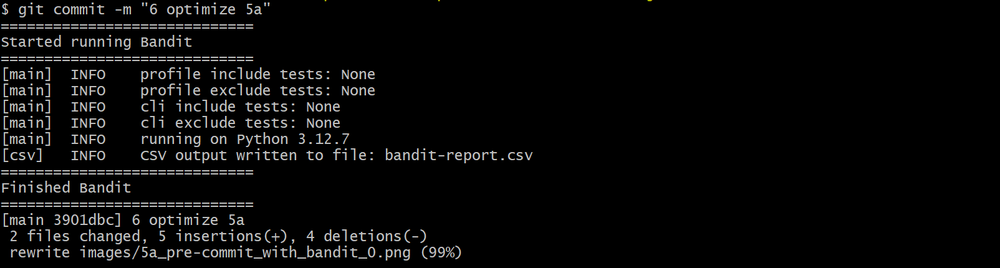

Here is the generated report: [bandit-report.csv](5a_hooks/bandit-report.csv)
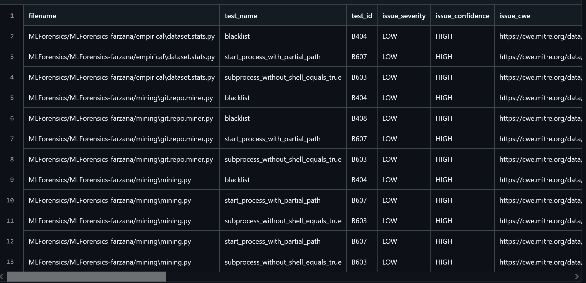

#### 5.b. Fuzz
The fuzzing implementation can be found in: \
YAML File: [fuzz.yml](.github/workflows/fuzz.yml) \
Python: [fuzz.py](MLForensics/MLForensics-farzana/bin/fuzz/fuzz.py)

Methods used:
1. getFileLength (from MLForensics\MLForensics-farzana\empirical\dataset.stats.py)
- Chosen because of method simplicity made it easier to test and fuzz
- Inputs include an invalid file, a none data type, invalid file name, and an empty string for a file name
- Failed all 4 inputs
2. getAllFileCount (from MLForensics\MLForensics-farzana\empirical\dataset.stats.py)
- Chosen because of empirical nature and simplicity of the method
- Inputs include an empty dataframe, path to a nonexistentent file, an invalid encoding, and a none data type
- Passed empty dataframe
- Failed the other 3
3. getAllSLOC (from MLForensics\MLForensics-farzana\empirical\dataset.stats.py)
- Chosen to test how fuzzing would work with the encoding scheme
- Inputs include an empty dataframe, a nonexistent file with UTF-8 encoding, an invalid encoding, and a none data type
- Passed with empty dataframe
- Failed with other 3 inputs
4. checkLoggingPerData (from MLForensics\MLForensics-farzana\FAME-ML\py_parser.py)
- Chosen to test how logging would work with fuzzing
- Inputs include a simple import, a none tree, an empty input, and a none data type
- Failed all 4 inputs
5. func_def_log_check (MLForensics\MLForensics-farzana\FAME-ML\py_parser.py)
- Chosen to fuzz declaration logging lists
- Inputs include a list with logging, a non-logging function with a logging argument, an empty input, and a none data type
- Passed the first three args
- Failed none data type input
6. getPythonExcepts (MLForensics\MLForensics-farzana\FAME-ML\py_parser.py)
- Chosen to see how fuzzing would handle these exceptions
- Inputs include a try exception, a none in the ast value, a tree with no exceptions, and a specific exception
- Passed try, tree with no exceptions, and specific exception case
- Failed none data type

Screenshots that show execution of fuzzing: \
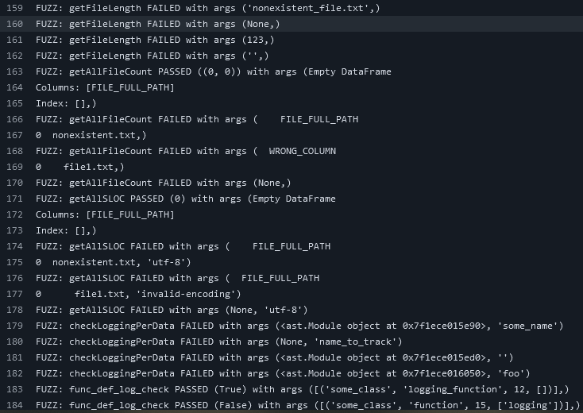
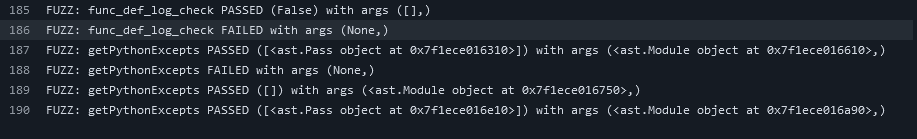

Successful run seen here: [runs/11677430049](https://github.com/GoellNico/DefectHunters-FALL2024-SQA/actions/runs/11677430049)

#### 5.c. Forensics
Files altered:
[repo_miner.py](MLForensics/MLForensics-farzana/mining/repo_miner.py) \
Note: This file was orignially called git.repo.miner.py. The name was altered in order to resolve issues regarding importing functions into our test file [main.py](MLForensics/MLForensics-farzana/mining/main.py). 

All logging is tested within [main.py](MLForensics/MLForensics-farzana/mining/main.py) in order to isolate and run the individual functions that include logging for debugging purposes. This file feeds all log output from [repo_miner.py](MLForensics/MLForensics-farzana/mining/repo_miner.py) into a file entitled [repo_mining_forensics.log](5c_forensics/repo_mining_forensics.log).

Additions:
1. deleteRepo - Is about managing repository deletions for data cleanup. Add loggin to track deletions and errors for traceability and debugging.
2. makeChunks - Is about dividing large lists into smaller chunks for processing. Add loggin to verify chunking and troubleshoot data distribution issues.
3. cloneRepo - Is about Cloning repositories locally for analysis. Add loggin to monitor successful/failed cloning operations for better oversight.
4. dumpContentIntoFile - Is about writing data to files. Add loggin to confirm file writing operations and handle errors efficiently.
5. getPythonCount - Is about counting Python files in directories. Add loggin to document the number of Python files processed for analysis accuracy.

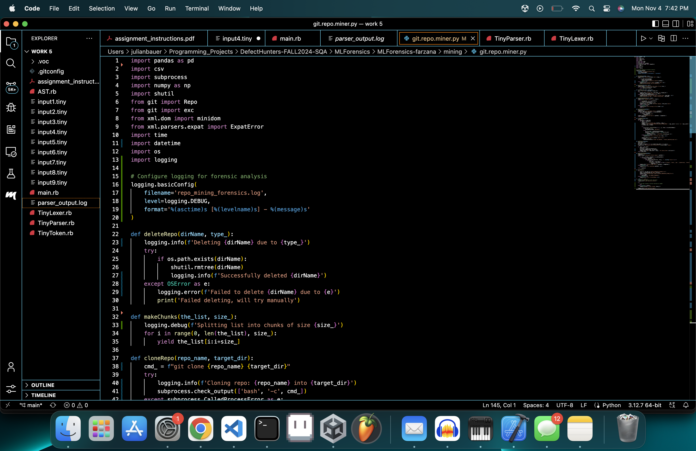
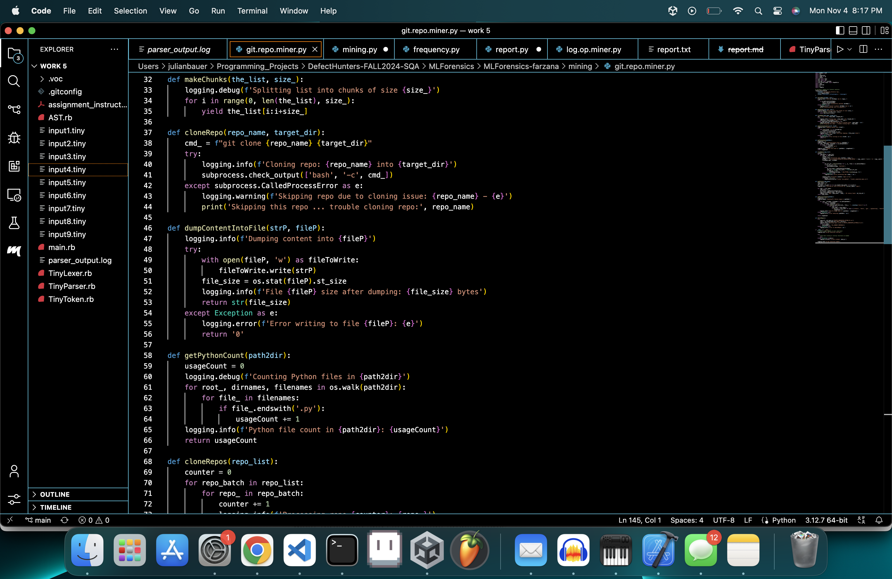
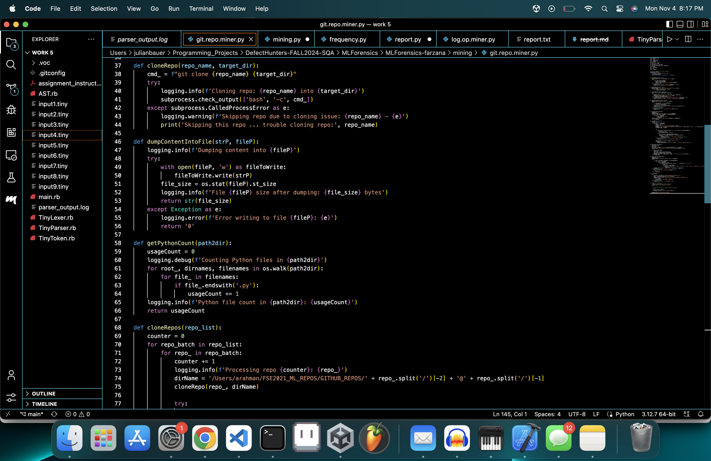
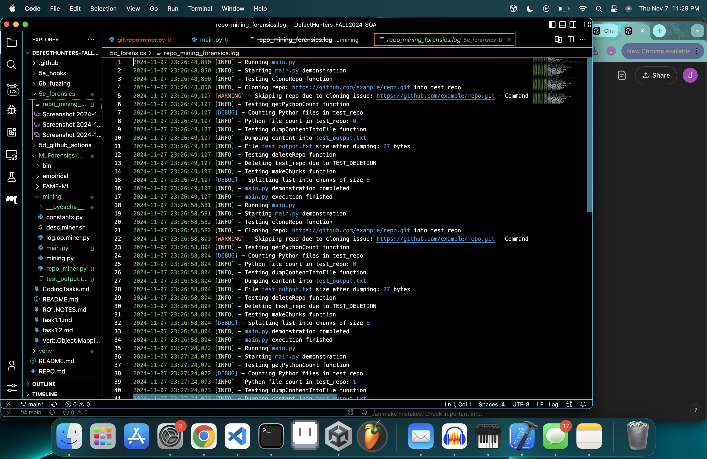
[Here](5c_forensics/repo_mining_forensics.log) you can find the logs.

To execute, simply run "python3 main.py" in [MLForensics/MLForensics-farzana/mining](MLForensics/MLForensics-farzana/mining) folder and find "repo_mining_forensics.py" within the same directory as [main.py](MLForensics/MLForensics-farzana/mining/main.py) and [repo_miner.py](MLForensics/MLForensics-farzana/mining/repo_miner.py) ([MLForensics/MLForensics-farzana/mining](MLForensics/MLForensics-farzana/mining)).

#### 5.d. Continuous Integration
Github Actions were utilized along with the Codacy static analysis tools to help with continuous integration and maintaining code quality. Utilizing a .yml file in the .github/workflows/ directory, we were able to add Codacy to scan through the source code.

As you can see here, Codacy ran completely and exited without error:
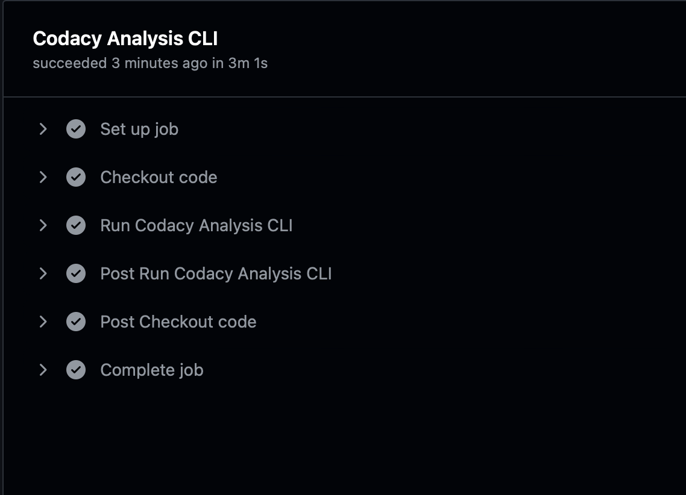

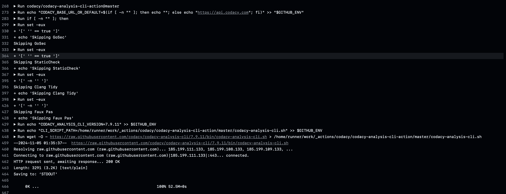

Finally, Codacy gives an overall metric of what kind of errors, issues, or warnings there are with the code to ensure that security measures are correctly implemented, as you can see here.
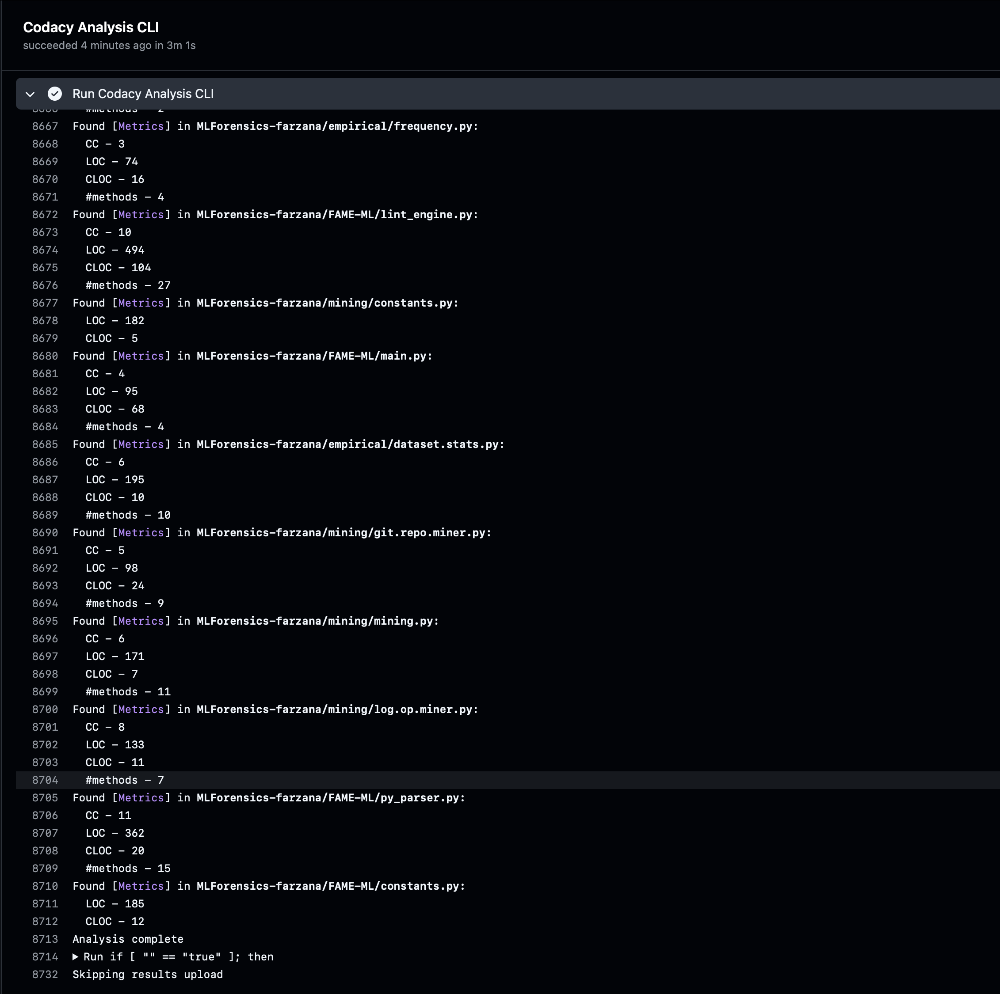

[Here](https://github.com/GoellNico/DefectHunters-FALL2024-SQA/actions/runs/11675889498/job/32511215142) is the link for the output of the above run of Codacy.

[Here](.github/workflows/codacy.yml) is the codacy.yaml file that was used to create the necessary Github Action to run Codacy.

### 6. Final Report

In Task 5a, we implemented a pre-commit Git hook, demonstrating how straightforward it is to add hooks that enhance code quality. For instance, we used static code analysis to automatically test changes before they are committed, reducing the risk of unknowingly introducing bugs. This approach ensures a higher quality standard for the main/master branch.

In Task 5b, we implemented a fuzzing method in our code that fuzzed 5 of our methods. Which with a python and yaml files added with a new Github action, we were able to log how our methods performed. This is very helpful in programming with the natural of unexpected values coming up in our methods.

In Task 5c, we explored the use of forensics as a method for logging key code locations. This approach helps us identify critical parts of the code, which is valuable for debugging and understanding unexpected behavior in production. It ensures functionality by making it easier to trace and analyze issues effectively.

In Task 5d, we implemented the Codacy static analysis tool in combination with Github Actions to scan our codebase whenever anything is pushed to our main branch. By implementing this, we are ensuring that our code quality is higher and there are fewer bugs and security issues within our codebase everytime anything is changed. When doing this specific project I learned more syntax with Github Actions and Codacy by implementing it to only scan the source directory.
